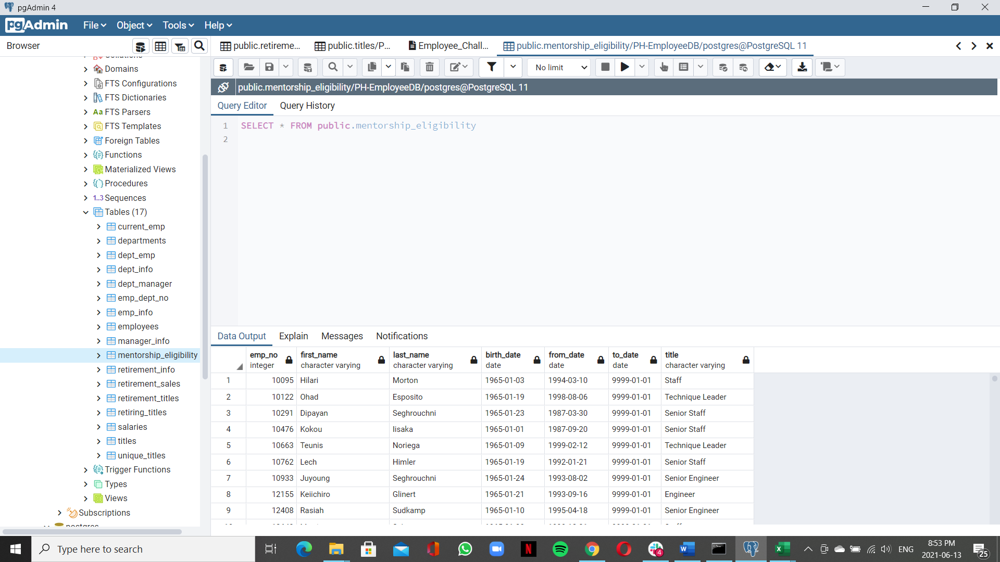

# Pewlett-Hackard-Analysis

## Overview of Analysis
This analysis is about creating two tables in order to know which employees are eligible for a mentorship program on the other hand the number of employees retireing and their title (postition),  in the Unique_titles file we included employee number, First name, Last name and title , in the  retiring_titles file we included the count of people  goint to retire for each department 
Mentorship eligibility file  consists employee number , First name , Last name ,birth date ,position title, from date  and to date 

## Results

      
   
   

Mentronship_eligibility.csv file iditifies employees who can apply for the program there are 1,549 employees that qualify for the mentorship program

   
   
 
 
 Retiring_titles.csv  file  iditifies Number of Retiring Employees per Title we can see   29414 of Senior Engineer Analysis 
senior positions will retire soon leaving a big gap for leaders in the company.
The company has to create a program to cover the empty vacancies  and should create a futue plan  to train a new eployees and cover these positions 
 
 ## Summary
 

Based on the project the company will be ineed of new employees taking the consideration 1,549 employees that qualify for the mentorship program  and how many younger employees need to be trained to fill up the retired positions ,we can create a query that gives us a list the amount of people that would be retiring soon based on the  age of the  retirement
